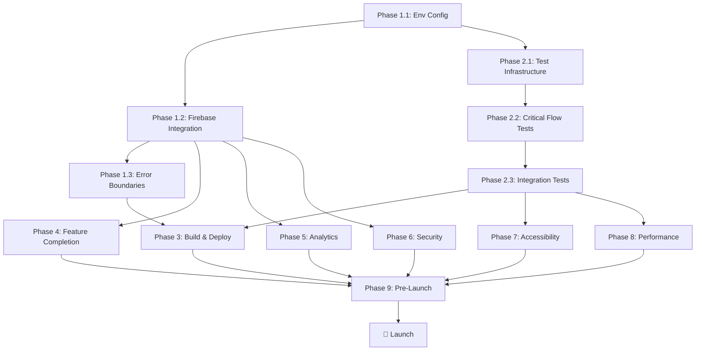

# Estate Ease - Implementation Roadmap (Visual)

## Timeline Overview (10-13 Weeks)

```
Week 1-3:  ████████████ Phase 1: Production Foundation
           ├─ Environment & Config (Week 1)
           ├─ Firebase Integration (Week 1-2)
           └─ Error Boundaries (Week 3)

Week 2-4:  ████████████ Phase 2: Testing & Quality
           ├─ Test Infrastructure (Week 2)
           ├─ Critical Flow Tests (Week 2-3)
           └─ Integration Tests (Week 4)

Week 3-5:  ████████████ Phase 3: Build & Deployment
           ├─ EAS Configuration (Week 3-4)
           ├─ Backend Deployment (Week 4)
           └─ App Store Prep (Week 5)

Week 2-5:  ████████████ Phase 4: Feature Completion
           ├─ Push Notifications (Week 2-3)
           ├─ Contact Agent (Week 3)
           ├─ Realtime Updates (Week 4)
           └─ Image Optimization (Week 5)

Week 3-4:  ████████████ Phase 5: Analytics & Monitoring
           ├─ Analytics Integration (Week 3)
           ├─ Error Tracking (Week 3)
           └─ Performance Monitoring (Week 4)

Week 4-5:  ████████████ Phase 6: Security Hardening
           ├─ Input Sanitization (Week 4)
           ├─ Image Security (Week 4)
           ├─ Rate Limiting (Week 5)
           └─ Security Audit (Week 5)

Week 6-7:  ████████████ Phase 7: Accessibility & Polish
           ├─ Accessibility Compliance (Week 6)
           ├─ UX Enhancements (Week 6-7)
           └─ Onboarding Flow (Week 7)

Week 7-8:  ████████████ Phase 8: Performance Optimization
           ├─ React Native Optimization (Week 7)
           ├─ Network Optimization (Week 7)
           └─ Bundle Size Optimization (Week 8)

Week 9-10: ████████████ Phase 9: Pre-Launch Validation
           ├─ QA Testing (Week 9)
           ├─ Load Testing (Week 9)
           └─ Launch Prep (Week 10)

Week 11+:  🚀 LAUNCH & Monitor
```

## Critical Path Dependencies



## Priority Matrix

### Must Have (P0) - Blockers for Launch
- ✅ Committed changes
- ✅ Line ending fixes
- ⬜ Firebase live integration
- ⬜ EAS build configuration
- ⬜ Basic test coverage (auth, listings)
- ⬜ App store listings
- ⬜ Security audit passed
- ⬜ QA sign-off

### Should Have (P1) - Launch Week 2-4
- ⬜ Push notifications working
- ⬜ Error tracking (Sentry)
- ⬜ Analytics integration
- ⬜ Performance monitoring
- ⬜ Accessibility compliance

### Nice to Have (P2) - Post-Launch
- ⬜ E2E test suite
- ⬜ Advanced image optimization
- ⬜ Realtime Firestore listeners
- ⬜ Image malware scanning
- ⬜ Content moderation API

## Weekly Milestones

### Week 1: Foundation
- [ ] Environment validation implemented
- [ ] Firebase projects created (dev/staging/prod)
- [ ] Backend Firebase Admin SDK wired
- [ ] Frontend Firebase Auth working

### Week 2: Integration & Testing
- [ ] All API endpoints work with live Firebase
- [ ] Test infrastructure set up
- [ ] Auth flow tests written
- [ ] Push notification infrastructure ready

### Week 3: Testing & Features
- [ ] 50%+ test coverage on critical paths
- [ ] Contact agent flow complete
- [ ] Error boundaries implemented
- [ ] EAS build configuration done

### Week 4: Deployment & Security
- [ ] First EAS preview build created
- [ ] Backend deployed to staging
- [ ] Security audit started
- [ ] Realtime updates implemented

### Week 5: Polish & Analytics
- [ ] Analytics tracking all key events
- [ ] Error tracking operational
- [ ] Image optimization complete
- [ ] App store listings drafted

### Week 6-7: Quality & Accessibility
- [ ] Accessibility audit complete
- [ ] UX enhancements done
- [ ] Onboarding flow implemented
- [ ] Performance optimizations applied

### Week 8-9: Final Validation
- [ ] Beta testing complete
- [ ] All critical bugs fixed
- [ ] Load testing passed
- [ ] App store submissions made

### Week 10: Launch Ready
- [ ] Final QA sign-off
- [ ] Monitoring dashboards set up
- [ ] Support team trained
- [ ] 🚀 Launch!

## Resource Assignment Guide

### Backend Developer Focus
- Phase 1.2: Firebase integration (PRIMARY)
- Phase 3.2: Backend deployment
- Phase 4.1: Push notifications (backend)
- Phase 5.2: Error tracking (backend)
- Phase 6: Security hardening (PRIMARY)
- Phase 9.2: Load testing

### Frontend Developer Focus
- Phase 1.3: Error boundaries
- Phase 2: Testing infrastructure & tests (PRIMARY)
- Phase 4.2: Contact agent flow
- Phase 4.3: Realtime updates
- Phase 7: Accessibility & polish (PRIMARY)
- Phase 8.1: React Native optimization

### Full-Stack Developer Focus
- Phase 1.1: Environment validation (BOTH)
- Phase 3.1: EAS configuration
- Phase 4.1: Push notifications (frontend)
- Phase 4.4: Image optimization (BOTH)
- Phase 5.1: Analytics integration (BOTH)
- Phase 5.3: Performance monitoring (BOTH)

### QA Engineer Focus
- Phase 2.3: Integration test expansion
- Phase 7.1: Accessibility testing
- Phase 9.1: Manual QA & beta testing (PRIMARY)
- Ongoing: Regression testing

### DevOps Focus
- Phase 3.2: Backend deployment (PRIMARY)
- Phase 3.3: CI/CD pipeline
- Phase 5.3: Monitoring setup
- Phase 6.3: Redis setup
- Phase 9.2: Load testing infrastructure
- Phase 9.3: Launch infrastructure

## Risk Heat Map

```
HIGH IMPACT
│
│  🔴 Firebase Migration      🔴 Store Approval
│  🟡 Security Audit          🟡 Performance
│
│  🟢 Analytics Integration   🟢 Accessibility
│  🟢 Image Optimization      🟢 Testing
│
└────────────────────────────────────────► HIGH LIKELIHOOD
```

### Risk Mitigation Status
- 🔴 High Priority - Address immediately
- 🟡 Medium Priority - Monitor closely
- 🟢 Low Priority - Standard process

## Decision Log

### Key Decisions Made
1. ✅ Use Firebase for backend (already chosen)
2. ✅ Mock-first development approach (implemented)
3. ✅ Feature-first code organization (implemented)
4. ✅ LF line endings everywhere (just fixed)

### Pending Decisions
- [ ] **Hosting Platform**: Cloud Run vs App Engine vs Heroku
- [ ] **CDN Choice**: Firebase Storage vs Cloudflare vs Fastly
- [ ] **Image Moderation**: Build vs Buy vs Skip for MVP
- [ ] **E2E Testing**: Detox vs Maestro vs Skip for now
- [ ] **Error Tracking**: Sentry vs Firebase Crashlytics
- [ ] **Analytics**: Firebase Analytics vs Mixpanel vs Amplitude

### Decision Criteria
Use this framework for pending decisions:

| Criteria | Weight | Questions to Ask |
|----------|--------|------------------|
| Cost | 25% | What's the monthly cost at 10K, 100K, 1M users? |
| Developer Experience | 20% | How easy to integrate and maintain? |
| Time to Implement | 20% | Can we do this in the available timeline? |
| Scalability | 20% | Will it handle 10x growth? |
| Vendor Lock-in | 15% | How hard to switch later? |

## Quick Start Commands

### Daily Development
```bash
# Backend
cd backend && npm run dev

# Frontend  
npm start

# Tests
npm run typecheck && npm run lint
cd backend && npm test
```

### Pre-Commit Checks
```bash
# Run before every commit
npm run typecheck
npm run lint
cd backend && npm run typecheck && npm run lint && npm test
```

### Deployment Commands (Future)
```bash
# Build preview
eas build --profile preview

# Deploy backend to staging
gcloud app deploy --project=estate-ease-staging

# Deploy Firestore rules
firebase deploy --only firestore:rules,firestore:indexes
```

## Success Criteria Checklist

### Phase 1 Complete When:
- [ ] App runs with real Firebase credentials
- [ ] All environments documented
- [ ] Error boundaries catch crashes gracefully
- [ ] Backend deployed to staging

### Phase 2 Complete When:
- [ ] 60%+ test coverage on critical paths
- [ ] All tests passing in CI
- [ ] Integration tests cover all API endpoints

### Phase 3 Complete When:
- [ ] Preview build runs on physical devices
- [ ] Backend auto-deploys from main branch
- [ ] App store listings submitted for review

### Launch Ready When:
- [ ] All P0 items complete
- [ ] Zero critical bugs
- [ ] QA sign-off received
- [ ] Monitoring dashboards operational
- [ ] Support team trained
- [ ] Rollback plan tested

## Metrics Dashboard (Track Weekly)

### Development Metrics
- [ ] Test coverage: ___% (Target: 60%+)
- [ ] Build success rate: ___% (Target: 95%+)
- [ ] Critical bugs: ___ (Target: 0)
- [ ] Code review turnaround: ___ hours (Target: <24h)

### Quality Metrics
- [ ] Crash rate: ___% (Target: <1%)
- [ ] API error rate: ___% (Target: <0.1%)
- [ ] P95 response time: ___ms (Target: <500ms)
- [ ] Lighthouse score: ___ (Target: >80)

### Progress Metrics
- [ ] Phases completed: ___ / 9
- [ ] P0 items complete: ___ / ___
- [ ] Days to launch: ___
- [ ] Budget used: ___% (Track against estimates)

---

*Update this roadmap weekly during standup. Move completed items to ✅ and adjust timelines as needed.*
